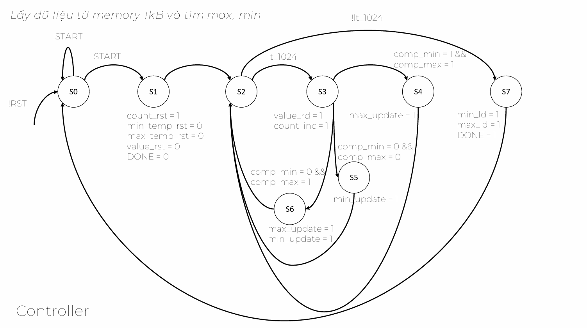
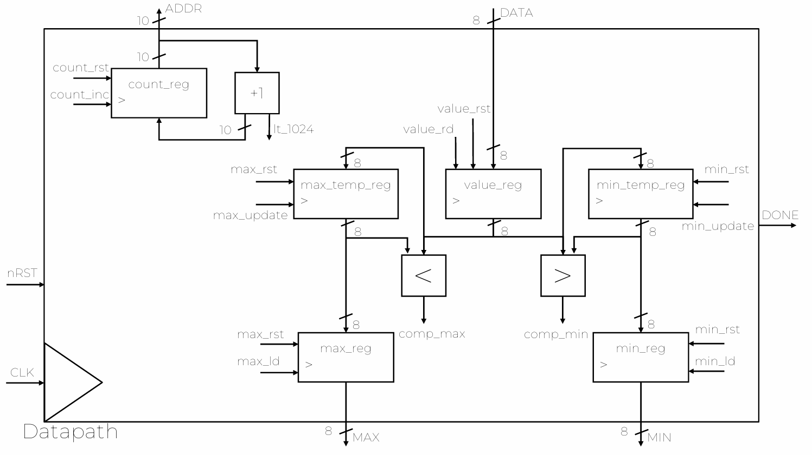
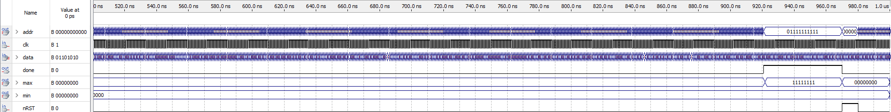

# Problem
Design the system that reads the data in 1KB memory and return the largest and smallest number stored in that memory using Verilog/SystemVerilog.

# Constraint
The system has:
- 3 inputs: clk, data and the reset signal. 
- 3 ouputs: largest, smallest, done.

When the system completes reading all 1024 addresses, it turns the flag 'done' to 1.

# Datapath and controller
This is official solution of my teacher:

# RTL view of my design

# Simulation result

- The largest number is likely 0xFF and the smallest number likely 0x00 because I generate 1024 random numbers in range [0;1023] but the data value is only from [0;255] (the address is 10 bit long and data is 8 bit long).
- The everything is set to 0 when the reset signal is set to 1. 